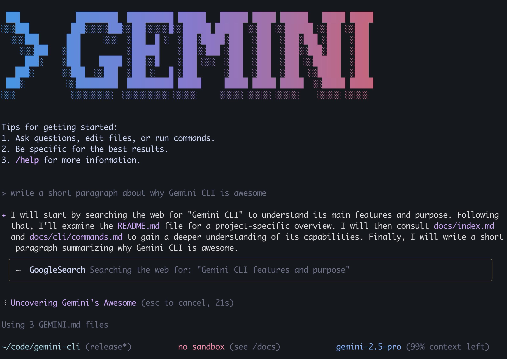

# 🚀 Gemini CLI

[](https://github.com/google-gemini/gemini-cli/actions/workflows/ci.yml)
[](https://badge.fury.io/js/%40google%2Fgemini-cli)
[](https://nodejs.org/)

<div align="center">



**Your AI-powered command-line companion that transforms how you build, explore, and automate.**

[🎯 Quick Start](#-quick-start) • [📚 Examples](#-examples) • [🛠️ Features](#-what-you-can-do) • [📖 Docs](./docs/index.md) • [🚨 Issues](https://github.com/google-gemini/gemini-cli/issues)

</div>

---

## 🎯 What is Gemini CLI?

The Gemini CLI is your **intelligent development assistant** that bridges the gap between natural language and code execution. Think of it as having a senior developer who understands your entire codebase, can read your mind, and executes complex tasks with surgical precision.

### ✨ What You Can Do

🔍 **Code Intelligence**
- Query and refactor massive codebases beyond Gemini's 1M token context window
- Get architectural insights and security analysis instantly
- Navigate complex systems with natural language queries

🎨 **Creative Generation**  
- Transform PDFs, sketches, or ideas into full applications using multimodal AI
- Generate everything from Discord bots to enterprise dashboards
- Convert mockups to production-ready code

⚡ **Workflow Automation**
- Automate complex git operations, PR reviews, and deployments  
- Connect with [MCP servers](https://modelcontextprotocol.io/) for unlimited tool integration
- Build custom workflows that understand your development patterns

🌐 **Enhanced Capabilities**
- [Media generation with Imagen, Veo & Lyria](https://github.com/GoogleCloudPlatform/vertex-ai-creative-studio/tree/main/experiments/mcp-genmedia)
- Built-in [Google Search grounding](https://ai.google.dev/gemini-api/docs/grounding) for real-time information
- Seamless integration with your existing development tools

## 🚀 Quick Start

> **Prerequisites**: Node.js ≥18.0.0 ([Download here](https://nodejs.org/en/download))

### Option 1: Instant Run (Recommended)
```bash
npx https://github.com/google-gemini/gemini-cli
```

### Option 2: Global Install
```bash
npm install -g @google/gemini-cli
gemini
```

### 🎨 First Launch Setup
1. **Choose your theme** - Pick from beautiful color schemes
2. **Authenticate** - Sign in with your Google account
   - ✅ **Free tier**: 60 requests/minute, 1,000 requests/day
   - 🚀 **No setup required** - Just your Google account!

**That's it!** You're ready to start building with AI.

---

### 🔑 Advanced Authentication

Need higher limits or specific models? Use an API key:

1. **Generate key**: Visit [Google AI Studio](https://aistudio.google.com/apikey)
2. **Set environment variable**:
   ```bash
   export GEMINI_API_KEY="your_key_here"
   ```
3. **Enterprise setup**: See [authentication guide](./docs/cli/authentication.md) for Google Workspace accounts

## 📚 Examples

> 💡 **Pro tip**: The magic happens when you combine natural language with your development context!

### 🆕 Starting Fresh
```bash
mkdir my-awesome-project && cd my-awesome-project
gemini
```
```text
> Write me a Discord bot that answers questions using a FAQ.md file I will provide
```

### 🔍 Exploring Existing Code
```bash
git clone https://github.com/google-gemini/gemini-cli && cd gemini-cli
gemini
```
```text
> Give me a summary of all the changes that went in yesterday
```

### 🚀 Real-World Examples

<details>
<summary><b>🏗️ Architecture & Code Review</b></summary>

```text
> Describe the main pieces of this system's architecture

> What security mechanisms are in place?

> Review this PR for potential issues and suggest improvements
```
</details>

<details>
<summary><b>🛠️ Feature Development</b></summary>

```text
> Implement a first draft for GitHub issue #123

> Help me migrate this codebase to the latest version of Java. Start with a plan

> Add TypeScript support to this project with proper configuration
```
</details>

<details>
<summary><b>🤖 Automation & Workflows</b></summary>

```text
> Make me a slide deck showing the git history from the last 7 days, grouped by feature

> Create a full-screen web app for displaying our most active GitHub issues

> Set up a CI/CD pipeline that deploys to staging on every PR
```
</details>

<details>
<summary><b>📁 File & System Operations</b></summary>

```text
> Convert all images in this directory to PNG and rename them using EXIF dates

> Organize my PDF invoices by month of expenditure

> Clean up this messy JavaScript project and add proper linting
```
</details>

---

### 📖 Next Steps

| Resource | Description |
|----------|-------------|
| [🚀 CLI Commands](./docs/cli/commands.md) | Master all available commands |
| [🔧 Troubleshooting](./docs/troubleshooting.md) | Solve common issues quickly |
| [📚 Full Documentation](./docs/index.md) | Comprehensive guides |
| [🤝 Contributing](./CONTRIBUTING.md) | Help improve Gemini CLI |
| [💡 Popular Tasks](#-popular-use-cases) | Get inspired with real examples |

## 🌟 Popular Use Cases

### 🕵️ Code Exploration & Understanding
*Perfect for new team members or exploring unfamiliar codebases*

```bash
cd any-project && gemini
```

<table>
<tr>
<td width="50%">

**🔍 Architecture Deep Dive**
```text
> Describe the main pieces of this 
  system's architecture

> What are the key design patterns used?

> Show me the data flow from API 
  to database
```

</td>
<td width="50%">

**🔒 Security & Quality Review**
```text
> What security mechanisms are in place?

> Find potential vulnerabilities in 
  this authentication code

> Review this code for performance 
  bottlenecks
```

</td>
</tr>
</table>

### 🚀 Development & Feature Building
*From idea to implementation in minutes*

<table>
<tr>
<td width="50%">

**⚡ Rapid Prototyping**
```text
> Implement a first draft for 
  GitHub issue #123

> Create a REST API for user 
  management with authentication

> Build a React component for 
  file uploads with progress bars
```

</td>
<td width="50%">

**🔄 Migration & Modernization**
```text
> Migrate this codebase to 
  TypeScript with proper types

> Upgrade this React app from 
  class components to hooks

> Convert these REST endpoints 
  to GraphQL
```

</td>
</tr>
</table>

### 🤖 Automation & DevOps
*Let AI handle the repetitive tasks*

<table>
<tr>
<td width="50%">

**📊 Reporting & Analytics**
```text
> Create a dashboard showing git 
  activity by team member

> Generate a performance report 
  from these log files

> Build a monitoring dashboard 
  for system health
```

</td>
<td width="50%">

**🔧 Infrastructure & CI/CD**
```text
> Set up GitHub Actions for 
  automated testing and deployment

> Create Docker configuration 
  for this application

> Build a monitoring script for 
  server uptime
```

</td>
</tr>
</table>

### 🗂️ File & Data Management
*Organize and transform your data intelligently*

<table>
<tr>
<td width="50%">

**🖼️ Media Processing**
```text
> Convert all images to WebP format 
  and optimize for web

> Extract metadata from all photos 
  and organize by date

> Resize images for different 
  device breakpoints
```

</td>
<td width="50%">

**📄 Document Management**
```text
> Organize PDF invoices by 
  month and vendor

> Extract data from CSV files 
  and create summary reports

> Convert markdown docs to 
  structured JSON
```

</td>
</tr>
</table>

---

> 💡 **The key to success**: Be specific about what you want, provide context, and don't be afraid to iterate!

---

## 📋 Additional Resources

<div align="center">

### 🤝 Community & Support

[](https://github.com/google-gemini/gemini-cli/issues)
[](https://github.com/google-gemini/gemini-cli/stargazers)
[](https://github.com/google-gemini/gemini-cli/network)

[💬 Discussions](https://github.com/google-gemini/gemini-cli/discussions) • [🐛 Report Bug](https://github.com/google-gemini/gemini-cli/issues/new) • [💡 Request Feature](https://github.com/google-gemini/gemini-cli/issues/new)

</div>

### 📚 Learning Resources

| Resource | Description |
|----------|-------------|
| [🎓 Tutorials](./docs/cli/tutorials.md) | Step-by-step guides for common tasks |
| [⚙️ Configuration](./docs/cli/configuration.md) | Customize Gemini CLI to your workflow |
| [🎨 Themes](./docs/cli/themes.md) | Beautiful color schemes for your terminal |
| [🔧 Advanced Features](./docs/cli/commands.md) | Power user commands and options |

### 🔗 Integrations

| Integration | Description |
|-------------|-------------|
| [🔌 MCP Servers](./docs/tools/mcp-server.md) | Connect external tools and services |
| [🌐 Web Search](./docs/tools/web-search.md) | Real-time information with Google Search |
| [📁 File System](./docs/tools/file-system.md) | Advanced file and directory operations |
| [💾 Memory](./docs/tools/memory.md) | Persistent context across sessions |

---

## ⚖️ Terms of Service and Privacy Notice

For details on the terms of service and privacy notice applicable to your use of Gemini CLI, see the [Terms of Service and Privacy Notice](./docs/tos-privacy.md).

---

<div align="center">

**Made with ❤️ by the Google Gemini team**

*Transforming the way developers build, one command at a time.*

[](LICENSE)

</div>
